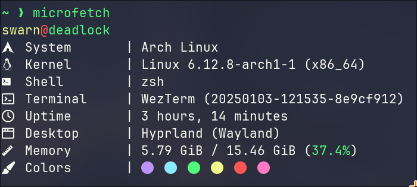

# Microfetch

Stupidly simple, laughably fast fetch tool. Written in C# for speed and ease of maintainability. Runs in a fraction of a millisecond and displays most of the nonsense you'd see posted on r/unixporn or other internet communities. Aims to replace [fastfetch](https://github.com/fastfetch-cli/fastfetch) on my personal system. Though, you are more than welcome to use it on your system: it's pretty fast...

